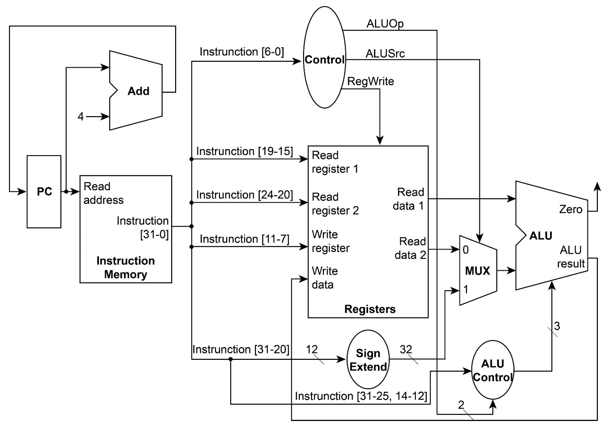

# Homework 4 : Single Cycle CPU

Implement a simple RISC-V CPU with Verilog. The CPU is single-cycle, all operations are assumed to be completed equally in one cycle. It should take 32-bit binary codes as input, and should do the corresponding RISC-V instructions, saving the result of arithmetic operations into the corresponding registers. Only arithmetic operations are covered and there will be no load/store instructions.

## Hardware Specification

* Register file: 32 registers
* Instruction Memory: 1KB
* Required Instruction Set

## Required Instruction Set

* `and rd, rs1, rs2`  (bitwise and)
* `xor rd, rs1, rs2`  (bitwise exclusive or)
* `sll rd, rs1, rs2`  (shift left logically)
* `add rd, rs1, rs2`  (addition)
* `sub rd, rs1, rs2`  (subtraction)
* `mul rd, rs1, rs2`  (multiplication)
* `addi rd, rs1, imm` (addition)
* `srai rd, rs1, imm` (shift right arithmetically)

## Data Path

## Implementation

* See [report.pdf](https://github.com/ChiehYin-Liao/NTU_CA_2020FALL/tree/main/HW4/README/r09922136_hw4_report.pdf)
