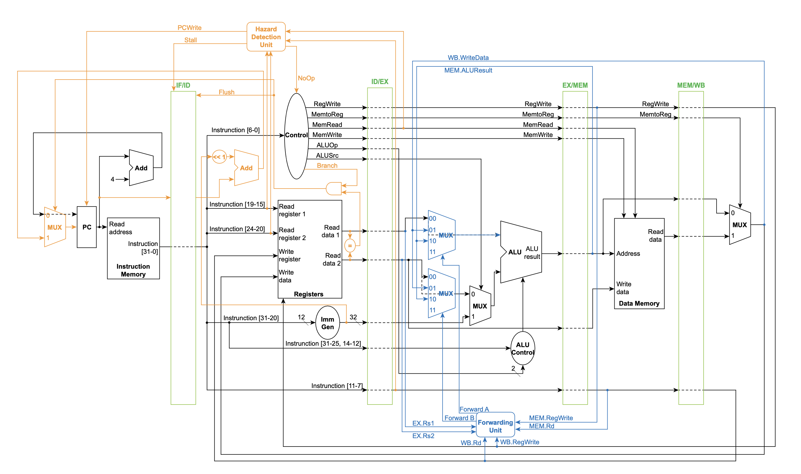

# Final Project 1 : Pipelined CPU

Extend Homework 4 to a pipelined CPU. It should take 32-bit binary codes as input and should do the corresponding RISC-V instructions, saving the result of arithmetic operations into the corresponding registers. 

## Hardware Specification

* Register file: 32 Registers (Write at the rising edge ofthe clock), 32-bit
* Instruction Memory: 1KB
* Data Memory: 4 KBytes
* 5-stage pipeline (IF, ID, EX, MEM, WB)
* Data hazard
    * Implement the forwarding unit to reduce or avoid the stall cycles
    * The data dependency instruction following `lw` must stall 1 cycle
    * No need to forward to ID stage
* Control hazard
    * The instruction following `beq` instruction may need to stall 1 cycle
    * Pipeline Flush

## Required Instruction Set

* `and`  (bitwise and)
* `xor`  (bitwise exclusive or)
* `sll`  (shift left logically)
* `add`  (addition)
* `sub`  (subtraction)
* `mul`  (multiplication)
* `addi` (addition)
* `srai` (shift right arithmetically)
* `lw` (load word)
* `sw` (store word)
* `beq` (branch if equal)

## Data Path

## Modules & Descriptions

### ALU.v
The ALU is the heart of where calculations take place in the processor. The ALU Control signal determines the corresponding action on data1_i and data2_i.

### ALU_Control.v
The input of the function code and opcode determine the ALU control signal (output). The value of ALUCtrl_o is updated if either ALUOp_i or funct_i is updated. Based on the input of funct_i, we set ALUCtrl_o to one of the following values.  
srai: 111  
addi: 100  
and: 001  
xor: 010  
sll: 011  
add: 100  
sub: 101  
mul: 110  
nop (else statement - default): 000  

### Adder.v
The inputs data1_in and data2_in are summed together and parsed to the output data_o.

### CPU.v
The 'driver' for all modules; the modules are interconnected according to the I/O in the datapath diagram. Part of our hazard detection unit (the NoOp signal, which is the output of the Hazard Detection Unit) and flush signal (based on whether we have to branch, if branch taken, then we need to flush the pipeline) are implemented in CPU.v.

### Control.v
Analyzes opcode (input) and converts to control signal (output)

### Data_Memory.v - provided
There are four inputs to the Data Memory including two indirectly from the Control module (MemRead and MemWrite), one for the calculated address indirectly from the ALU, and one for Write Data that is indirectly from the output of Read data 2 of registers.

### Forwarding_Unit.v
The input of the forwarding unit which resides in the Execution (EX) stage is to forward data from either the output of the EX/MEM pipeline segment or the output of the MEM/WB segment.
Our forwarding unit chooses corresponding ALU inputs in the execution stage. The ALU’s operands are from the register file if no hazards are present, but if there is a hazard, the operands are from either MEM_WB or EX_MEM. The sources for the ALU are selected by two multiplexers.

### Hazard_Detection_Unit.v
The forwarding unit cannot be used for every situation. Sometimes stalling is necessary for preventing data hazards while also ensuring proper execution of all instructions. The function of the hazard detection unit is to decide whether or not to stall. There will be a stall in the case of a Load Use (R-type instruction after lw that uses the same register as lw) hazard. Stall_o and PCWrite_o are set to (1 and 0) OR set to (0 and 1), indicating whether or not to stall.

### IF_ID.v
**1**: This is the pipeline register module between the Instruction Fetch and Instruction Decode stages. Just like all other pipeline registers, output registers here are updated on the positive clock edge, and there is a start_i signal that will update register values only when true. If flush_i is 1, then all instructions are reset to 0. Otherwise, if stall_i is 1, then the outputs for both PC and instruction are updated to their corresponding input values.

### ID_EX.v
**2**: This is the pipeline register module between the Instruction Decode and Execute stages. Just like all other pipeline registers, output registers here are updated on the positive clock edge. All control signals from the Control, all register outputs, and all instructions needed for the next stage are stored. The start_i signal is used for initializing the registers, and if start_i is 0, no output register values will be updated.

### EX_MEM.v
**3**: This is the pipeline register module between the Execute and Memory stages. All output register values are updated on the positive clock edge. The values updated include RegWrite_o, MemWrite_o, MemRead_o, MemtoReg_o, ALU_rst_o, writeData_o, and RDaddr_o.

### MEM_WB.v
**4**: This is the pipeline register module between the Memory and Write Back stages. Just like all other pipeline registers, output registers here are updated on the positive clock edge. Just like in Stage 1 and 2, output register values are updated only when start_i is true. The control signals, data memory, and register address are stored in this stage.

### Instruction_Memory.v - provided
The instruction memory is placed directly in front of the program counter. The output instr_o is set to the input address logically right-shifted two spots.

### MUX32.v
Multiplexer module: if select_i is 0, set data_o to data1_i, otherwise set it to data2_i.

### MUX_Forwarding.v
Our multiplexer forwarding module has four inputs: data1_i, data2_i, data3_i, and select_i. select_i indicates the source of the operand; if select_i is 00, the operand comes from register file and data_o is set to data1_i, if select_i is 01, the operand comes from data memory and data_o is set to data2_i, and if select_i is 10, the operand comes from the output of the ALU and data_o is set to data3_i.

### PC.v - provided
This is the program counter. If rst_i is 1, then pc_o is set to 0. Otherwise if PCWrite_i is true and if start_i is true, then the value of pc_o is updated to pc_i on the positive clock edge.

### Registers.v - provided
As specified in the data path, there are 6 inputs and two outputs to the Registers module. The registers are updated to RDdata_i if RegWrite_i is true and if RDaddr_i is not set to 0. Also, the outputs RS1data_o and RS2data_o are set to either the input RDdata_i or to register[RS1addr_i] depending on whether both RSxaddr_i (x is replaced with 1 or 2) is equal to RDaddr_i and RegWrite_i is true.

### Sign_Extend.v
16-bit input converted to 32-bit output

### testbench.v - provided
testbench.v dumps its output into CPU.vcd; this file is provided by the TA, showing the Register contents and Data Memory contents at each cycle.

## Difficulties Encountered & Solutions

Much of our debugging was done by using print statements from testbench. In testbench, we printed the values of the wires and used this to triangulate the source of errors. We had difficulties when we were configuring the CPU wires and this was the source of some bugs that we subsequently fixed.

## Development Environment
OS: Mac OSX Mojave  
Compiler: iverilog  
IDE: Atom

## Team Members & Contributions
Sylvia Liao (R09922136): Wrote most of project code, participated in meetings, wrote report
Seth Austin Harding (B06902101): Provided base code & references, helping with coding, organized/participated in meetings, wrote report
Sangyoo Woo (B04902126): Wrote report, participated in meetings
