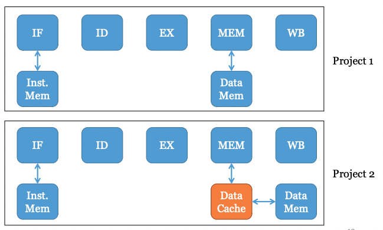
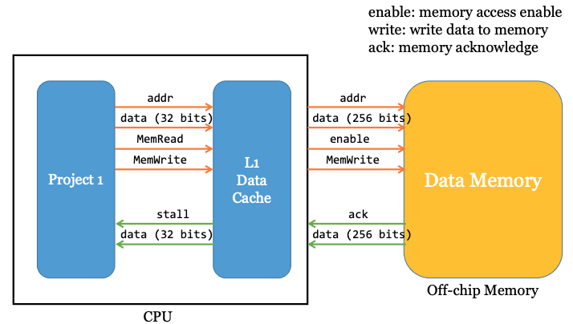
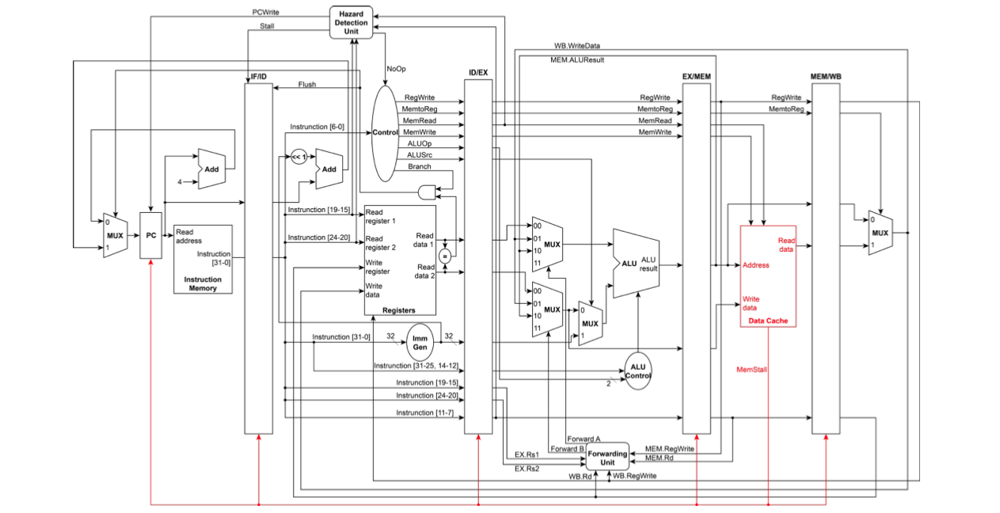
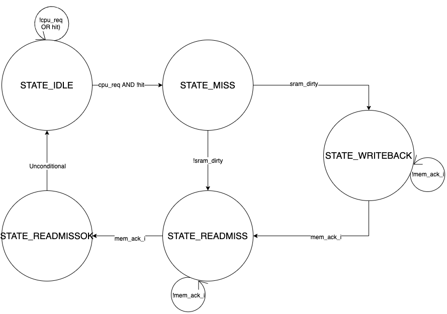

# Final Project 2 : Pipelined CPU With Cache

Extend Homework 4 to a pipelined CPU. It should take 32-bit binary codes as input and should do the corresponding RISC-V instructions, saving the result of arithmetic operations into the corresponding registers. 

## Hardware Specification

* Register file: 32 Registers (Write at the rising edge ofthe clock), 32-bit
* Instruction Memory: 1KB
* Data Memory: 4 KBytes
* 5-stage pipeline (IF, ID, EX, MEM, WB)
* Data hazard
    * Implement the forwarding unit to reduce or avoid the stall cycles
    * The data dependency instruction following `lw` must stall 1 cycle
    * No need to forward to ID stage
* Control hazard
    * The instruction following `beq` instruction may need to stall 1 cycle
    * Pipeline Flush

* Off-chip Data Memory
    * Size: 16KB
    * Data width: 32 Bytes
    * Memory access latency: 10 cycles (send an ack when finish access)

* L1 Data Cache • 
    * Size: 1KB
    * Associative: 2-way
    * Replacement policy: LRU
    * Cache line size: 32 Bytes
    * Write hit policy: write back
    * Write miss policy: write allocate
    * offset: 5 bits, index: 4 bits, tag: 23 bits

## Required Instruction Set

* `and`  (bitwise and)
* `xor`  (bitwise exclusive or)
* `sll`  (shift left logically)
* `add`  (addition)
* `sub`  (subtraction)
* `mul`  (multiplication)
* `addi` (addition)
* `srai` (shift right arithmetically)
* `lw` (load word)
* `sw` (store word)
* `beq` (branch if equal)

## Project1 to Project2

## System Block Diagram

## Data Path

## Modules & Descriptions

Using CPU.v from project 1, we build upon it and implement this more advanced and realistic datapath that takes into consideration the fact that data memory is in reality much slower and has much more delay than in our previous simulation. On-chip data cache (DRAM) is a resource in high demand and low supply, and so a memory modularity for effective and quick communication between off-chip data memory and cache is critical.

### dcache_controller.v
The controller determines whether the upcoming load/store is a hit or miss. Then according to the write back and write allocate policy, properly interact with CPU and Data_Memory. The finite state machine for the cache controller is illustrated below.

As shown in our FSM, the controller alternates between the above 5 states. The FSM starts at an STATE_Idle state, and waits until there is a request (if no request or memory hit, the state will not change). Upon receiving a request and a miss, the state changes to STATE_Miss, and there are two possibilities; if the SRAM is dirty, controller will set write_back = 1, mem_enable = 1, mem_write = 1 (because we need to write back to memory and made data coherence between cache and memory) then change state to STATE_Writeback; otherwise, controller will set mem_enable true because we need to read data from memory then STATE_Readmiss state will be initiated. If it changes to STATE_Readmiss, STATE_Readmiss will wait to receive ack. If changes to STATE_Writeback, then it will stay in STATE_Writeback until receiving an ack implies the datas are ready then it will set mem_enable = 1,  mem_write = 0, write_back = 0 then go to STATE_Readmiss. STATE_Readmiss will wait to receive an ack (set mem_enable = 0, mem_write = 0, cache_write = 1) and write back to cache before going to the STATE_Readmissok state before finally unconditionally returning to the Idle state.

### dcache_sram.v
This module stores tags and data of the cache, and support 2-way associative and LRU replacement policy.
We construct a two-dimensional register array LRU (size 16x2) that we use to implement the Least Recently Used replacement policy for 2-way associative cache, and set the least recently use block to 1 and the other to 0. 

By either rst_i (reset input) or by the positive edge of the clock (clk_i) , when rst_i is true we initialize the cache and set the values for the all registers (tag, data, and LRU) to 0. Otherwise, if enable_i and write_i are both true, it means that we have a request to write int cache, we determine whether it is a way-0 hit, a way-1 hit, then we set the LRU then write data into cache or a read miss and we need to read data from memory, then write data to cache that are not recently used, then update the LRU to keep track on the least recently used way of the cache.

By the positive edge of the clock (clk_i) and enable_i is true, it means that there is a read from cache and we need to set the LRU to know which block is recently used.

We got three output named data_o, tag_o and hit_o in this module, when there is a hit on way-0 or way-1, then hit_o is true, otherwise is false. And if there is a hit on way-0 or way-1, data_o and tag_o will directly read from cache from the right index(addr_i), otherwise it will get the data update from data memory that is in the least recently used block.

### testbench.v
We initialize reg in our pipeline registers before any instruction is executed, and connect CPU and off-chip Data_Memory in this module.

### CPU.v
We replace the Data_Memory in our Project 1 with the cache controller, then add six port named mem_data_i, mem_ack_i, mem_data_o, mem_addr_o, mem_enable_o, mem_write_o to connect off-chip Data_Memory in module testbench.

## Development Environment
OS: Mac OSX Mojave and Mac OS Catalina
Compiler: iverilog
IDE: Atom and Sublime

## Members & Teamwork
Team Members & Contributions
* Sylvia Liao (R09922136): Wrote most of project code, organized/participated in meetings, wrote report  
* Seth Austin Harding (B06902101): Assisted with coding, organized/participated in meetings, wrote report  
* Sangwoo Yoo (B04902126): Wrote report and added graphs for explanation, participated in meetings  

## Difficulties Encountered and Solutions in This Project
We had several bugs in our program that caused the PC to output 0 and the signal to output X for every cycle. They were mainly caused by minor syntax errors such as in the Verilog difference between 1'b0 and 0, the logic in some of the pipeline registers, and the logic in dcache_controller.v as well as extraneous outputs from modified version of testbench. These bugs were fixed simply by simply reviewing in more detail the Verilog syntax and making sure that the operations of each module are logically equivalent to their corresponding explanations in the textbook.
