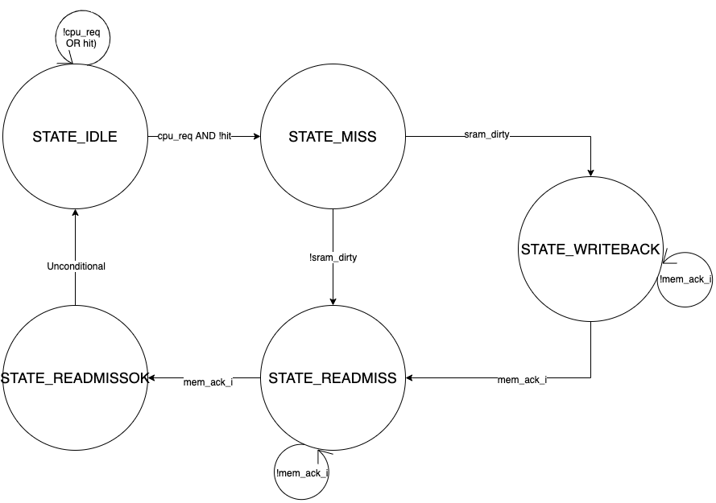
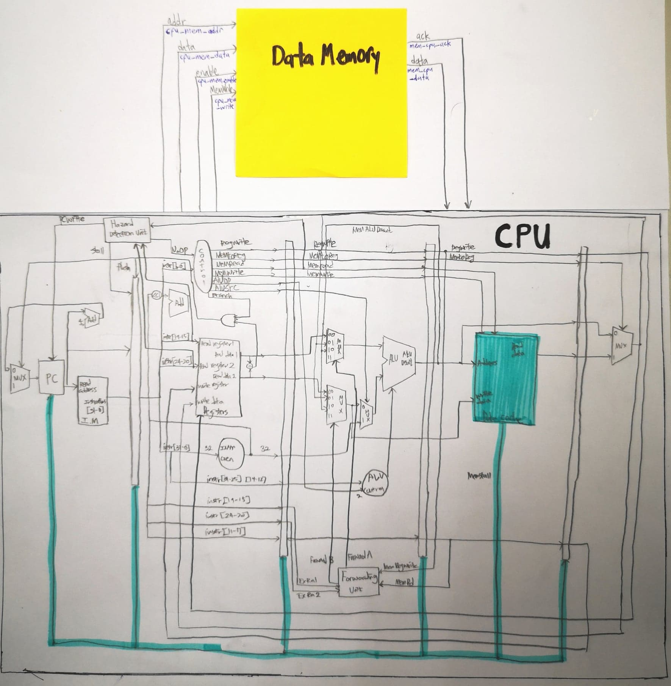

# CA Project 2

## Members & Teamwork
Team Members & Contributions
Sylvia Liao (R09922136): Wrote most of project code, organized/participated in meetings, wrote report  
Seth Austin Harding (B06902101): Assisted with coding, organized/participated in meetings, wrote report  
Sangwoo Yoo (B04902126): Wrote report and added graphs for explanation, participated in meetings  

## Modules & Descriptions

Using CPU.v from project 1, we build upon it and implement this more advanced and realistic datapath that takes into consideration the fact that data memory is in reality much slower and has much more delay than in our previous simulation. On-chip data cache (DRAM) is a resource in high demand and low supply, and so a memory modularity for effective and quick communication between data memory and cache is critical. We determine in dcache_top.v whether its a hit or miss. If it's a hit, then we read/write the memory address, and if it's a miss, then we call the cache controller logic.

### dcache_controller.v
This module functions to determine hit or miss. dcache_controller is responsible for connecting with the SRAM interface and the Data_Memory interface. The finite state machine for the cache controller is illustrated below.

As shown in our FSM, the controller alternates between the above 5 states. The FSM starts at an Idle state, and waits until there is a request (if no request, the state will not change). Upon receiving a request, the state changes to Miss, and there are two possibilities; if the SRAM is dirty, the state will change to Writeback; otherwise, Readmiss will be initiated. If it changes to to Readmiss, Readmiss will wait to receive ack. If changes to to Writeback, then it will stay in Writeback until receiving an ack to go to Readmiss. Readmiss will wait to receive an ack before going to the Readmissok state before finally unconditionally returning to the Idle state.

The architecture and connection between the CPU and the Data Memory is illustrated here. We initialize our off-chip data_memory module in testbench.v.

Below, we summarize the functionality of the dcache_sram module.

### dcache_sram.v
We construct a two-dimensional register array LRU (size 16x2) that we use to implement the Least Recently Used replacement policy for 2-way associative cache. We also store the cache's data and tags two register arrays of an equal size to LRU. We implement the logic for write hit and for read miss. The write hit logic is called by either rst_i (reset input) or by the positive edge of the clock (clk_i). If rst_i is true, we set the values for the three registers (tag, data, and LRU) to 0. Otherwise, if enable_i and write_i are both true, we determine whether it is a way-1 hit, a way-2 hit, or a read miss, setting the register values accordingly. Finally, we implement our logic for read miss upon the positive clock edge.

### testbench.v
We start by initializing the values for the pipeline registers. The logic for cache management is added in testbench (printing cache values, cache flushing, etc).

### CPU.v
As stated above, the only change we make to the CPU is the removal of on-chip Data_Memory and the addition of dcache_controller.

## Development Environment
OS: Mac OSX Mojave and Mac OS Catalina
Compiler: iverilog
IDE: Atom and Sublime

## Difficulties Encountered and Solutions in This Project
We had several bugs in our program that caused the PC to output 0 and the signal to output X for every cycle. They were mainly caused by minor syntax errors such as in the Verilog difference between 1'b0 and 0, the logic in some of the pipeline registers, and the logic in dcache_controller.v as well as extraneous outputs from modified version of testbench. These bugs were fixed simply by simply reviewing in more detail the Verilog syntax and making sure that the operations of each module are logically equivalent to their corresponding explanations in the textbook.
